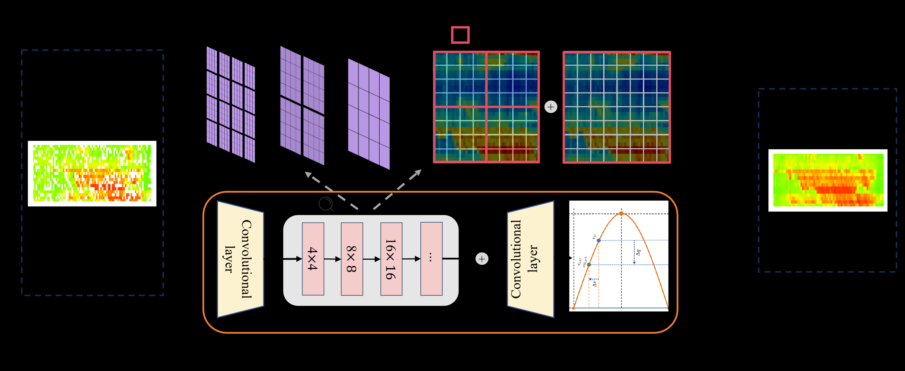

# PRMAN

## A physics-regularized multiscale attention network for spatiotemporal traffic data imputation

Implemented by ***

## Requirements

Python 3.9
Pytorch
torch_geometric
Numpy
einops
PIL
tsl

## Introductions

---

## Instructions

You can directly run the PRMAN_main to train the PRMAN and imputed speed matrices will be saved. The origin MAPE, reocvered MAPE, and recovered RMSE will be reported. You can also demonstrate the corresponding speed matrices with figures to visually observe the denoising performance of our model.

## Folders of repo

### Baseline

The implementations of historical mean method, KNN, BATF, BGCP and LSTC methods

### Data

Under the Data folder, there are the original data and the corresponding data processing modules. Meanwhile, a class named MultiMaskTimeSeriesDataset is defined as the dataset for both training data and test data.

| dataset         | url                                                                  | Description                                                                                                                                                                                                                                                                                                                    |
| --------------- | -------------------------------------------------------------------- | ------------------------------------------------------------------------------------------------------------------------------------------------------------------------------------------------------------------------------------------------------------------------------------------------------------------------------ |
| METR-LA         | https://github.com/liyaguang/DCRNN                                   | The METR-LA dataset is recorded from 207 loop detectors deployed onhighways in Los Angeles County. The dataset is collected from March 1st,2012, to June 27th, 2012. It provides a comprehensive representation ofhighway traffic conditions, offering detailed measurements of traffic speedand flow.                         |
| PEMS04          | https://github.com/Davidham3/ASTGCN/tree/master/data/PEMS04          | The PEMS04 dataset is derived from the Performance Measurement Sys-tem (PeMS) in California. It includes data from over 300 sensors and of-fers comprehensive traffic speed and flow information across various roadsegments. The traffic data are recorded at 5-minute intervals from Jan-uary 1, 2018, to February 28, 2018. |
| Seattle dataset | https://github.com/zhiyongc/Seattle-Loop-Data                        | The Seattle dataset is collected from loop detectors installed on majorroads in Seattle, USA. It covers the entire year of 2005, with traffic speedand flow recorded at 5-minute intervals, offering a detailed overview ofurban traffic conditions.                                                                           |
| SanDiegodataset | https://data.transportation.gov/Automobiles/San-Diego-Test-Data-Sets | The SanDiego dataset, provided by the U.S. Department of Transporta-tion, is sourced from the traffic monitoring system in SanDiego, California.It contains data collected from 2007 to 2010, covering traffic speed, flow,and density.                                                                                        |

### GA-GAN

https://github.com/pihang/GA-GAN

### ImputeFormer

https://github.com/tongnie/ImputeFormer

### PRMAN

